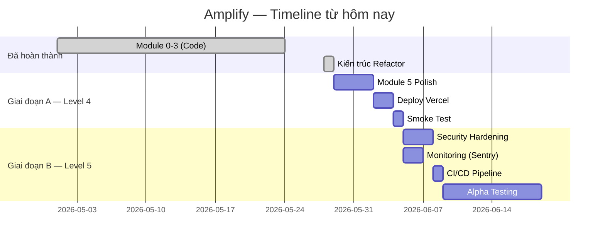

# Master Plan v3: Nền tảng AI Marketing Đa kênh — Amplify
**Kế thừa từ:** masterplan_v2.md · **Ngày cập nhật:** 28/05/2026  
**Bối cảnh:** Dự án cá nhân tại Việt Nam · Nhóm 50+ người dùng · Không commercial SaaS

---

## Thay đổi so với v2

| Mục | v2 | v3 |
|-----|----|----|
| AI Model | Gemini 2.5 Flash + DeepSeek fallback | **Chỉ Gemini 2.5 Flash** + retry exponential backoff |
| Kiến trúc code | Flat `components/` + monolithic `lib/` | **Feature-Sliced Architecture** (4 layers) |
| Mục tiêu level | Chưa xác định | **Level 4 (Full-Stack Serverless)** → Level 5 (Production-Ready) |
| Scope | Bao gồm Phase 4 mở rộng | **Tập trung Phase A + B**, giai đoạn C gác lại |
| Trạng thái | Kế hoạch trên giấy | **Module 0–3 đã code xong**, đang hoàn thiện Module 4–5 |

---

## Tổng quan Sản phẩm

### Sản phẩm là gì
Một nền tảng web giúp người dùng tái chế một bài viết dài (blog, báo cáo, script video) thành nhiều bản nháp nội dung ngắn cho các kênh mạng xã hội khác nhau (LinkedIn, Facebook, X/Twitter), đảm bảo giọng văn nhất quán với thương hiệu cá nhân của từng người.

### Vòng lặp giá trị cốt lõi
```
Nạp bài gốc → AI tái chế theo Brand Voice → Xem & Sửa → Copy đi đăng tay
```

### Những gì KHÔNG build
- Tự động đăng bài qua API LinkedIn/X
- Thanh toán / Stripe / Paywall
- DeepSeek fallback (đã disable hoàn toàn)
- Anti-Shadowban Scheduler
- Chrome Extension
- Screenshot tự động / Tài liệu báo cáo

---

## Kiến trúc Hệ thống

### Sơ đồ Thành phần

```
[Browser]
    │ HTTPS
    ▼
[Frontend — Next.js 15 App Router]
    │
    │ API Routes (same project)
    ▼
[Backend — Next.js Route Handlers]
    │
    ├────────────────┬─────────────────────┐
    │                │                     │
    ▼                ▼                     ▼
[Supabase DB]   [Inngest Cloud]      [Gemini 2.5 Flash]
(PostgreSQL     (Background          (@google/genai)
 + RLS)          Workers)
```

### Tech Stack (Đã chốt + Đã build)

| Layer | Công nghệ | Phiên bản | Trạng thái |
|-------|-----------|-----------|-----------|
| Frontend | Next.js (App Router) + React + TypeScript | 15.5.18 / 19.2.3 | ✅ Build xong |
| Styling | Tailwind CSS v4 | 4.1.18 | ✅ Build xong |
| UI Library | Lucide React + Framer Motion | 0.561.0 / 12.23.26 | ✅ Build xong |
| Database + Auth | Supabase (PostgreSQL + Auth + RLS) | SSR 0.10.3 | ✅ Build xong |
| Background Jobs | Inngest | 3.54.2 | ✅ Build xong |
| AI | Google Gemini 2.5 Flash (`@google/genai`) | 2.3.0 | ✅ Build xong |
| URL Scraping | jsdom + @mozilla/readability | 29.1.1 / 0.6.0 | ✅ Build xong |
| Deploy | Vercel (Free tier) | — | ❌ Chưa deploy |

### Kiến trúc Code: Feature-Sliced (✅ Đã refactor)

```
frontend/
├── app/                              ─── ROUTING (thin) ───
│   ├── (auth)/    login/, register/
│   ├── (app)/     dashboard/, onboarding/, review/
│   └── api/       brand-vault/, jobs/, drafts/, inngest/
│
├── components/                       ─── SHARED UI (11 primitives) ───
│   ├── ui/        Button, Card, Input, Modal, Skeleton,
│   │              StatusBadge, Tabs, Tag, Toast
│   └── layout/    AppLayout, Sidebar
│
├── features/                         ─── BUSINESS LOGIC ───
│   ├── auth/           actions.ts
│   │                   hooks/
│   ├── brand-vault/    components/ (6)    hooks/
│   ├── jobs/           components/ (5)    hooks/
│   └── review/         components/ (7)    hooks/
│
├── lib/                              ─── INFRASTRUCTURE ───
│   ├── types/     index.ts, user.ts, job.ts, brand-vault.ts
│   ├── constants/ index.ts
│   ├── utils/     format.ts
│   ├── ai/        client.ts, prompts.ts, parser.ts, index.ts
│   ├── inngest/   client.ts, brand-vault.worker.ts,
│   │              repurpose.worker.ts, helpers.ts, index.ts
│   └── supabase/  client.ts, server.ts, admin.ts, middleware.ts
│
└── middleware.ts
```

**Nguyên tắc:**
- `app/` → Chỉ routing, càng mỏng càng tốt
- `features/` → Business logic nhóm theo domain
- `lib/` → Infrastructure dùng chung, mỗi file một responsibility
- `components/` → UI primitives dùng chung (không thuộc domain nào)

---

## Trạng thái Hiện tại (28/05/2026)

### Module Tracker

| Module | Trạng thái | Chi tiết |
|--------|-----------|----------|
| Module 0 — Project Setup | ✅ Hoàn thành | Next.js 15, Supabase, Inngest, Tailwind v4 |
| Module 1 — Auth | ✅ Hoàn thành | Login/Register, middleware, RLS |
| Module 2 — Brand Vault | ✅ Code xong | 3 flows (URL/Text/Form), Gemini integration |
| Module 3 — Repurposing Engine | ✅ Code xong | 4 kênh song song (Promise.all), retry logic |
| Module 4 — Review Dashboard | ✅ Code xong | API routes + Frontend components hoàn chỉnh |
| Module 5 — Polish & Error Handling | ⚠️ Một phần | Skeleton, Toast có sẵn. Thiếu: Error boundary, Empty states chi tiết |
| Kiến trúc refactor | ✅ Hoàn thành | Feature-Sliced Architecture, build thành công |
| Deploy Vercel | ❌ Chưa làm | — |
| Testing | 📋 Có test plan | TEST_PLAN.md, TC-01→TC-15 |

### Cập nhật triển khai bổ sung (14/06/2026)

Đã bổ sung nhánh Alpha hardening và distribution:

- Security hardening: validation tập trung, rate limit 20 jobs/ngày cho user `free`, security headers, `/api/health`.
- Observability nhẹ: structured logging cho API chính, thống kê Admin từ dữ liệu jobs/users.
- CI/CD: script `lint`, `typecheck` và GitHub Actions frontend CI.
- Admin Alpha Panel: `/admin`, danh sách users, failed jobs, retry job, export feedback CSV.
- Social Distribution v1: `/settings` kết nối X/Facebook Page, publish từ Review, Facebook fallback Copy + Open.
- Schema mới: `social_accounts`, `publish_attempts`, `alpha_feedback`.

### API Routes (Đã build)

| Endpoint | Method | Chức năng |
|----------|--------|-----------|
| `/api/brand-vault/analyze-text` | POST | Trigger Inngest phân tích text |
| `/api/brand-vault/analyze-url` | POST | Trigger Inngest phân tích URL |
| `/api/brand-vault/from-form` | POST | Phân tích form (sync, không qua Inngest) |
| `/api/brand-vault/save` | POST | Lưu voice profile đã confirm |
| `/api/jobs` | GET | Danh sách jobs của user |
| `/api/jobs` | POST | Tạo job mới, trigger Inngest |
| `/api/jobs/[id]` | GET | Chi tiết job + drafts (is_current=true) |
| `/api/drafts/[id]` | PATCH | Autosave content, mark done |
| `/api/drafts/[id]/regenerate` | POST | Tạo draft mới, tăng version |
| `/api/inngest` | GET/POST/PUT | Inngest webhook endpoint |

### Database Schema (Đã deploy trên Supabase)

4 bảng: `profiles`, `brand_vaults`, `repurpose_jobs`, `drafts` — tất cả có RLS enabled.

---

## Kế hoạch Scale-up: 2 Giai đoạn

### Architecture Maturity Levels

| Level | Tên | Amplify đang ở đâu |
|-------|-----|---------------------|
| 3 | Full-Stack Web Application | ✅ Đã đạt |
| **4** | **Full-Stack Serverless Web Application** | **← Mục tiêu giai đoạn A** |
| 5 | Production-Ready Web Application | ← Mục tiêu giai đoạn B |

---

### 🔴 Giai đoạn A: Hoàn thiện Level 4 — MVP Deployment (1–2 tuần)

> Mục tiêu: Sản phẩm chạy được end-to-end trên Vercel, đủ để demo.

#### A1. Module 5 — Polish & Error Handling (3–4 ngày)

- [ ] Error boundary cho React components (không crash toàn app)
- [ ] Empty states chi tiết:
  - Chưa có Brand Vault → hướng dẫn tới `/onboarding`
  - Chưa có jobs → hướng dẫn tạo bài mới
  - Job failed → hiển thị error message thân thiện
- [ ] Loading Skeletons cho Dashboard, Review (đã có components, cần kết nối)
- [ ] Toast notification hoàn chỉnh (đã có component)
- [ ] Responsive check: 1280px, 1440px (desktop only)

#### A2. Deploy lần đầu (1–2 ngày)

- [ ] Push code lên GitHub (private repo)
- [ ] Kết nối Vercel → GitHub repo
- [ ] Cấu hình Environment Variables trên Vercel:
  ```
  NEXT_PUBLIC_SUPABASE_URL
  NEXT_PUBLIC_SUPABASE_ANON_KEY
  SUPABASE_SERVICE_ROLE_KEY
  GOOGLE_AI_API_KEY
  INNGEST_SIGNING_KEY
  INNGEST_EVENT_KEY
  ```
- [ ] Kết nối Inngest Cloud (tạo account, lấy signing key)
- [ ] Test deploy: URL → login → Brand Vault → job → review → copy
- [ ] Fix bất kỳ lỗi nào phát sinh trên production

#### A3. Smoke Test trên Production (1 ngày)

- [ ] Test toàn bộ flow E2E trên Vercel URL thật
- [ ] Tạo Brand Vault với cả 3 flows (URL, Text, Form)
- [ ] Submit job → kiểm tra 4 drafts được tạo
- [ ] Autosave, Copy, Regenerate hoạt động
- [ ] Không có lỗi console trên Chrome

**📅 Tổng: 5–7 ngày | Kết quả: MVP trên Vercel, Level 4 đạt được**

---

### 🟡 Giai đoạn B: Production-Ready — Level 5 (2–3 tuần)

> Mục tiêu: Đủ an toàn và ổn định để mời 5–10 người test Alpha.

#### B1. Security Hardening (2–3 ngày)

- [ ] Input validation cho tất cả API routes:
  - `source_content`: không rỗng, không quá 5000 từ
  - `channels[]`: chỉ chứa giá trị hợp lệ (`linkedin_post`, `linkedin_thread`, `facebook`, `twitter`)
  - `brand_vault_id`: thuộc về user hiện tại (RLS đã handle nhưng validate thêm)
- [ ] Rate limiting cơ bản: 20 jobs/ngày cho user `free`
  - Dùng counter trong DB: `SELECT COUNT(*) FROM repurpose_jobs WHERE user_id = ? AND created_at > now() - interval '1 day'`
- [ ] Sanitize AI output trước khi render (chống XSS):
  - Sử dụng text-only rendering (không `dangerouslySetInnerHTML`)
  - Hoặc dùng `DOMPurify` nếu cần HTML
- [ ] Bật xác minh email trên Supabase Dashboard (production)
- [ ] Security headers trong `next.config.ts`:
  ```
  X-Content-Type-Options: nosniff
  X-Frame-Options: DENY
  Referrer-Policy: strict-origin-when-cross-origin
  ```

#### B2. Monitoring & Observability (1–2 ngày)

- [ ] Cài Sentry: `npx @sentry/wizard@latest -i nextjs`
  - Bắt exceptions từ Frontend + API Routes + Inngest Workers
- [ ] Tạo endpoint `GET /api/health`:
  ```json
  { "status": "ok", "db": "connected", "timestamp": "..." }
  ```
- [ ] Structured logging cho API routes:
  - Log mỗi request: method, path, user_id, status_code, duration_ms
  - Log mỗi AI call: model, tokens, latency, success/fail

#### B3. CI/CD Pipeline (1 ngày)

- [ ] GitHub Actions workflow: lint + type-check + build on push to `main`
- [ ] Auto deploy Vercel on merge to `main`
- [ ] Branch protection: require PR review

#### B4. Alpha Testing (1–2 tuần)

- [ ] Viết hướng dẫn sử dụng ngắn (5 bước + screenshot)
- [ ] Chuẩn bị Google Form thu thập feedback
- [ ] Mời 5–10 người test:
  - Tiêu chí: đang viết content, có 3–5 bài viết để test
- [ ] Thu thập feedback theo 4 câu hỏi:
  1. Hoàn thành flow trong 5 phút?
  2. Giọng văn giống bạn? (1–5)
  3. Điểm nào gây khó chịu?
  4. Dùng lại tuần sau?
- [ ] Fix critical bugs từ feedback

**Tiêu chí thành công Phase B:**
- ≥4/5 hoàn thành flow trong 5 phút
- ≥3/5 cho điểm giống giọng ≥3/5
- Không có crash/stuck/mất data

**📅 Tổng: 8–14 ngày | Kết quả: Production-Ready, Level 5**

---

## Data Model (Không đổi từ v2)

Giữ nguyên 4 bảng: `profiles`, `brand_vaults`, `repurpose_jobs`, `drafts`.  
Chi tiết schema: xem [supabase-schema.sql](file:///d:/Chuong%20Trinh%20Dai%20Hoc/chuyendetotnghiep/AI_maketing_da_kenh_web/supabase-schema.sql).

---

## Chiến lược AI (Cập nhật)

### Model duy nhất: Gemini 2.5 Flash
- **Không dùng DeepSeek** — đã disable hoàn toàn
- Retry logic: exponential backoff (3s → 6s → 12s → 24s), tối đa 4 lần
- Nếu fail sau 4 lần retry → job `status = 'failed'` với error_message rõ ràng
- Free tier: 15 RPM — đủ cho 50 users không đồng thời

### Prompt Management
Tất cả prompts được quản lý tập trung tại [lib/ai/prompts.ts](file:///d:/Chuong%20Trinh%20Dai%20Hoc/chuyendetotnghiep/AI_maketing_da_kenh_web/frontend/lib/ai/prompts.ts):
- `VOICE_ANALYSIS_PROMPT` — phân tích giọng văn từ text
- `VOICE_FROM_FORM_PROMPT` — phân tích từ form khảo sát
- `REPURPOSE_PROMPT_TEMPLATES` — 4 kênh (LinkedIn Post, Thread, Facebook, Twitter)

### Brand Voice Strategy
- JSON config + cached System Prompt (không dùng vector embeddings)
- System Prompt được cache trong `brand_vaults.system_prompt`
- Rebuild khi user update Brand Vault

---

## Các quyết định đã chốt (Cập nhật từ v2)

| Quyết định | Giá trị | Lý do |
|------------|---------|-------|
| AI Model | Chỉ Gemini 2.5 Flash | Đơn giản, free tier đủ dùng |
| DeepSeek | ❌ Disabled | Không cần fallback model |
| Polling vs Realtime | Polling 2s | Đơn giản, đủ UX |
| URL Scraping | ✅ Build (POC passed) | jsdom + readability, giới hạn 5000 từ |
| Rate limit | 20 jobs/ngày (free) | Chống abuse |
| Email verification | Bật khi production | Supabase built-in |
| Ngôn ngữ UI | Tiếng Việt + English labels | Song ngữ |
| Mobile | Không hỗ trợ (desktop only) | Scope constraint |
| Deploy | Vercel free tier | Zero config |
| Mục tiêu level | Level 4 → Level 5 step-by-step | Không push cùng lúc |

---

## Phụ lục: Tính năng SHOULD HAVE (Giai đoạn C — Tạm gác)

Sẽ xem xét sau khi Phase B hoàn thành thành công:

1. Lịch sử tái chế + search (2–3 ngày)
2. Nhiều Brand Vault per user (2 ngày)
3. Template kênh tùy chỉnh (3–4 ngày)
4. Export drafts (.txt / .md) (1 ngày)
5. Admin panel đơn giản (3–4 ngày)
6. A/B test prompt versions
7. "Like" button cho drafts → học preference

---

## Timeline Tổng quan



**Tổng thời gian còn lại:** 3–5 tuần (tùy thời gian alpha testing)
# Cap nhat ngay 14/06/2026 - Tong ket cong viec hom nay

## 1. Nhung phan da hoan thanh

- Hoan thien nhanh **Alpha hardening + distribution**:
  - Them validation tap trung cho API quan trong.
  - Them rate limit co ban cho user `free`.
  - Them security headers.
  - Them `/api/health`.
  - Them structured logging nhe cho API/Inngest.
  - Them GitHub Actions frontend CI.
- Hoan thien **Admin Alpha Panel**:
  - Route `/admin` co guard theo `profiles.user_plan = 'admin'`.
  - User thuong bi chan bang man "Khong co quyen truy cap".
  - Admin co nen tang de xem users, failed jobs, retry job va export feedback CSV.
- Hoan thien **Social Distribution v1** theo huong approval-first:
  - Them social accounts cho X va Facebook Page.
  - Them publish attempts.
  - Them Settings/Social Accounts de connect/disconnect.
  - Review page co cac hanh dong Prepare X, Prepare Facebook, Prepare LinkedIn.
  - Copy + Open fallback cho X, Facebook, LinkedIn.
  - Khong tu dong dang khi user chi mark done; user phai chu dong xac nhan.
- Bo sung **LinkedIn handoff**:
  - Khong dung prefill text vi LinkedIn khong co compose URL on dinh cho noi dung tu dong.
  - App copy noi dung roi mo LinkedIn feed/share de nguoi dung tu dan, chinh sua va dang.
- Doi **Publish to X** thanh **Prepare X**:
  - X cung di qua modal preview truoc.
  - Draft qua 280 ky tu bi chan dang truc tiep.
  - Nguoi dung van co Copy + Open X de tu thao tac.
- Thiet ke lai UI theo huong **Clean SaaS, App-first**:
  - Giam radius card/button ve khoang 8px.
  - Giam shadow, giam layout card lon, dung border nhe va nen trung tinh.
  - Lam lai app shell/sidebar responsive.
  - Dashboard gon hon voi stats compact va job list de scan.
  - Create form chia nhom ro: Brand Vault, Source, Channels, Title, Submit.
  - Review page gon hon: source panel, draft editor, autosave status, action toolbar, distribution panel.
  - Settings social chuyen thanh card/row compact.
  - Admin panel chuyen thanh bang va card loi gon hon.
  - Landing page duoc dong bo nhe de khong lech visual qua nhieu voi app.
- Lam sach copy tieng Viet o cac man chinh da chinh:
  - Dashboard.
  - Create content.
  - Review.
  - Settings.
  - Admin.
  - Landing page.

## 2. Test thuc te da chay hom nay

- Da test voi vai tro nguoi dung cuoi qua in-app Browser tren local app `http://127.0.0.1:3000`.
- Da vuot qua login that bang Supabase Auth.
- Da kiem tra dashboard, Brand Vault active, tao job, Review, Settings social va admin guard.
- Da xac nhan Inngest local can chay dung dev mode khi dung `next start`:
  - Next server can `INNGEST_DEV=1`.
  - Inngest Dev Server can sync duoc app `amplify`.
- Da xac nhan Review page mo duoc draft that, co source panel, draft tabs, editor va distribution panel.
- Da kiem tra Prepare X modal:
  - Co preview.
  - Co Copy + Open X.
  - Nut dang truc tiep bi disable khi draft vuot 280 ky tu.
- Da kiem tra Settings social:
  - X/Facebook card hien thi dung.
  - Khi thieu OAuth env, UI bao loi cau hinh thay vi crash.
- Da kiem tra responsive nhanh:
  - Dashboard mobile co mobile header/bottom nav.
  - Review mobile khong bi horizontal overflow.
  - Review mobile van co du 3 nut Prepare.
- Da chay source checks:
  - `npm.cmd run typecheck` pass.
  - `npm.cmd run lint` pass.
- Da kiem tra browser console sau cac man chinh:
  - Khong thay console error.

## 3. Ket qua hien tai sau ngay 14/06/2026

San pham hien da di xa hon MVP "chi tao va copy noi dung". Amplify hien co the duoc mo ta la:

```text
Dang nhap -> Thiet lap Brand Vault -> Tao noi dung da kenh -> Review/chinh sua -> Prepare social post -> Copy/Open hoac dang co xac nhan
```

Diem quan trong cua chien luoc san pham da thay doi:

- Khong tu dong phan phoi noi dung ngay sau khi AI tao xong.
- Phan phoi la buoc co kiem soat, approval-first.
- App ho tro nguoi dung di tu san xuat noi dung sang chuan bi phan phoi, nhung van giu quyen dang cuoi cung cho nguoi dung.

## 4. Cac van de con lai can xu ly

- `npm.cmd run build` bi timeout sau 180 giay o buoc banner Next.js, chua co loi cu the. Can chay lai voi thoi gian dai hon hoac kiem tra moi truong build.
- `/api/health` hien tung tra `401 Unauthorized` trong E2E report. Can dam bao health endpoint public hoac duoc exclude khoi middleware auth.
- Can test lai OAuth that khi da co env:
  - `TOKEN_ENCRYPTION_KEY`
  - `X_CLIENT_ID`
  - `X_CLIENT_SECRET`
  - `X_REDIRECT_URI`
  - `FACEBOOK_APP_ID`
  - `FACEBOOK_APP_SECRET`
  - `FACEBOOK_REDIRECT_URI`
- Can test admin bang tai khoan co `profiles.user_plan = 'admin'`.
- Can test lai Copy bang browser that neu in-app Browser gap gioi han clipboard.
- Can kiem tra sau bug cu trong E2E report:
  - Channel selection mismatch.
  - Autosave co the stuck khi switch draft tab.
  - Brand Vault text/URL flow co dau hieu reset UI trong mot vong test.
- Onboarding/login van con mot phan copy/style cu; chua nam trong dot App-first polish hom nay.

## 5. Uu tien tiep theo

1. Fix `/api/health` public check.
2. Kiem tra va fix channel selection mismatch.
3. Kiem tra autosave khi switch tab.
4. Tao hoac promote mot admin test account de test full Admin Alpha Panel.
5. Cau hinh OAuth env staging de test X/Facebook that.
6. Chay lai production build voi timeout dai hon va ghi nhan log day du.
7. Polish tiep onboarding/login de dong bo Clean SaaS toan bo app.

---
